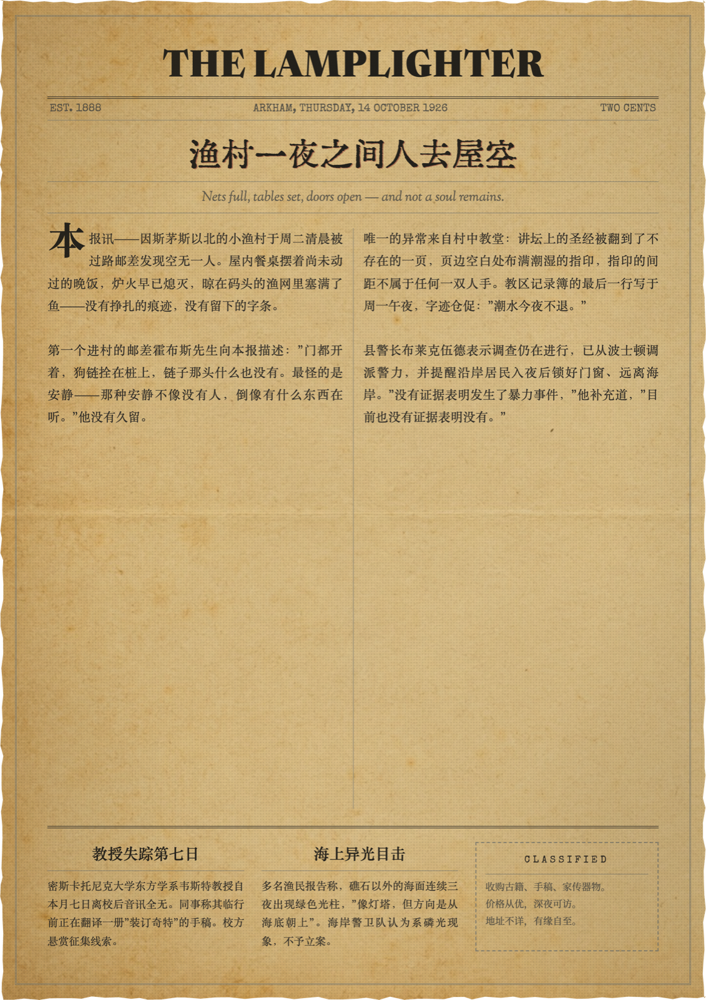
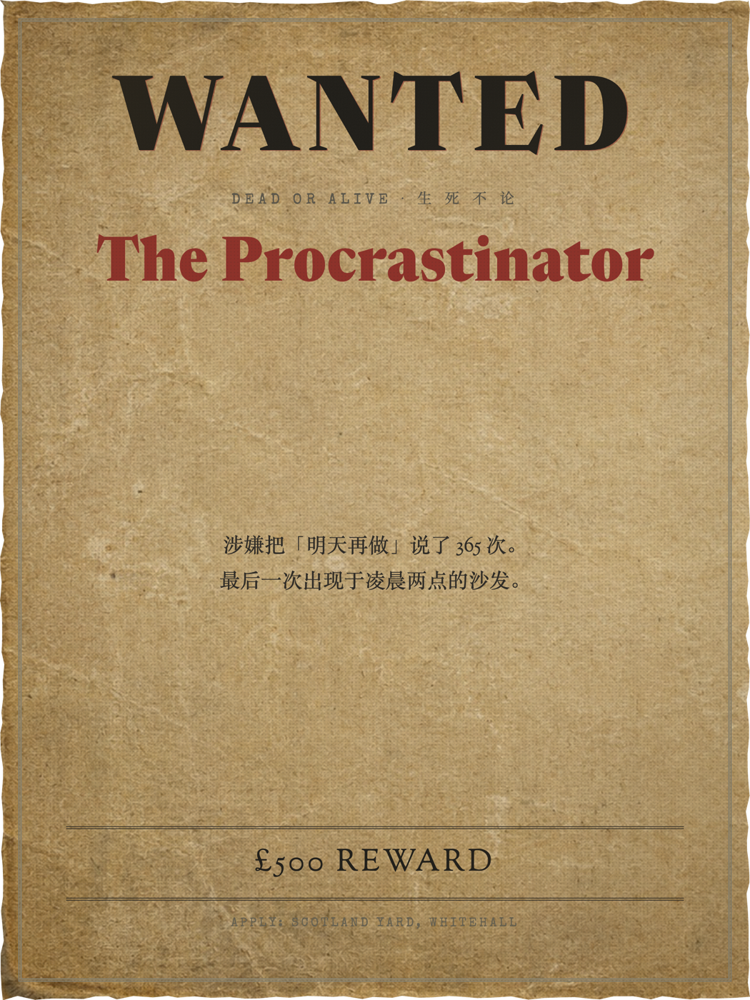
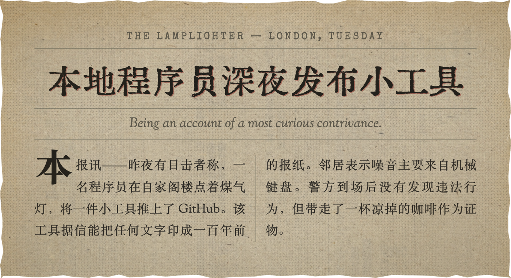
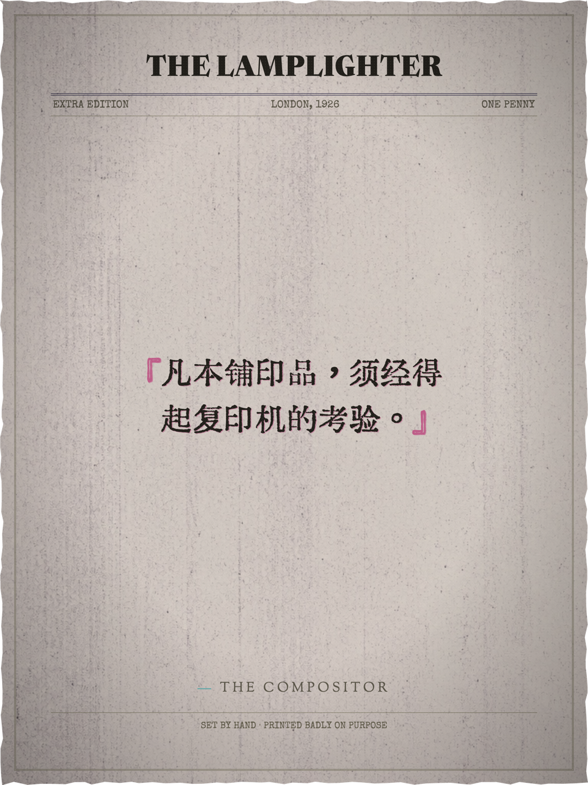

# The Lamplighter · 点灯人

[中文](#中文) · [English](#english)

## 中文

**把文章、金句和公告，排成一张真正像旧伦敦报纸的图片。**

The Lamplighter 是一个开源的浏览器报纸图片生成器，也是一套可安装的 Agent Skill。它把可编辑文字、1920s 英式编辑排版、自托管中英文字体、真实新闻纸纹理和高清 PNG 导出放在同一个纯前端项目里。

> Write the story. Set the type. Send it to press.

**🕯 在线试用：<https://starinzlob.github.io/the-lamplighter/>**（无需安装，打开即排版）

### 印品样张 Specimens



<p>



</p>

### 它能做什么

- **五种成品模板**：金句卡、报纸剪报、整版头版、通缉令和电报。
- **标题始终可修改**：报头、文章标题、正文、日期和署名都是实时文字，不是烘焙进背景的图片。
- **中英文混排**：英文标题使用 Lamplighter Display，中文自动回退到汇文明朝体与宋体系统。
- **三套标题铅字**：Lamplighter、Huiwen、Goudy，可按文章语言和气质切换。
- **三种墨水主题**：日版新闻纸、煤气灯夜版、蒸汽波错版。
- **真实印刷质感**：粗网点、纸张纤维、油墨渗透、轻微套印偏移和不规则纸边。
- **2× PNG 导出**：导出前等待字体加载，成品与浏览器预览保持一致。
- **零构建、零后端**：静态 HTML、CSS 和 JavaScript，文字编辑与渲染都在浏览器内完成。
- **Agent 可直接出稿**：仓库内的 `SKILL.md` 包含文章结构、文案语气、字体规范、模板映射和完整导出流程。

### 快速开始

**最快的方式：直接打开在线版 <https://starinzlob.github.io/the-lamplighter/>。**

想在本地跑：

```bash
git clone https://github.com/starinzlob/the-lamplighter.git
cd the-lamplighter
python3 -m http.server 8642
```

然后打开：

```text
http://127.0.0.1:8642
```

不需要安装依赖，也不需要构建。首次加载需要联网获取 `html-to-image` 和部分 Google Fonts。

### 使用流程

1. 选择印刷品模板。
2. 修改报头、标题、正文、日期与署名。
3. 选择标题字体、墨水主题和输出尺寸。
4. 检查中英文换行和版面层级。
5. 点击 **开印 · PRINT**，导出 2× 高清 PNG。

### 五种印刷品

| 模板 | 适合内容 | 输出尺寸 |
|------|----------|----------|
| **金句卡** | 摘录、格言、社交媒体分享图 | 1080×1440 · 1080×1080 · 1280×720 |
| **报纸剪报** | 短新闻、发布记录、生日贺报、梗图 | 860×自适应 |
| **整版报纸** | 完整文章、调查头版、CoC 跑团道具 | 1240×1754 · 1080×1440 |
| **通缉令** | 角色卡、活动海报、朋友的“罪行” | 1080×1440 |
| **电报** | 公告、状态更新、Changelog | 1280×720 · 1200×900 |

#### 给守密人

整版报纸可以把主案件、两条边栏简讯和一则分类广告排在同一张头版上。日期栏支持随机生成 Arkham、Innsmouth、London、Shanghai 等 1920s 城市与日期，A4 导出后可直接作为 CoC 等时代跑团的桌面道具。

### 标题与字体

The Lamplighter 把报头和文章标题分成两个独立层级：

- **报头**：默认使用自托管的 `Lamplighter Display`，适合英文出版物名称。
- **英文标题**：默认使用 Lamplighter；文学性较强的文章可切换 Goudy。
- **中文标题**：选择 Huiwen，或由字体栈自动回退到汇文明朝体、Noto Serif SC 与系统宋体。
- **中英混排**：两套字形在同一标题中按字符自动匹配，不需要把标题做成图片。
- **长标题**：报头自动缩小以保持单行；文章标题允许两至三行平衡换行。

`Lamplighter Display` 是基于 [Newsreader](https://github.com/productiontype/Newsreader) 72pt ExtraBold 制作的半窄幅衍生标题字体，覆盖拉丁大小写、数字、常用标点和西欧字符。字体按照 SIL Open Font License 1.1 分发，许可文件见 [`assets/fonts/lamplighter-OFL.txt`](assets/fonts/lamplighter-OFL.txt)。

### 作为 Agent Skill 使用

这个仓库不仅提供视觉模板，还能教 Agent 完成一篇文章：判断事实与虚构边界、写标题和副题、控制篇幅、选择字体、填写模板、预检排版并导出 PNG。

使用开放的 [`skills`](https://github.com/vercel-labs/skills) CLI 安装：

```bash
npx skills add starinzlob/the-lamplighter -g
```

安装后可以直接提出类似请求：

```text
用 Lamplighter 把这条产品更新写成一篇中文报纸剪报并导出 PNG。

把这组跑团线索写成 1926 年 Arkham 的头版，加入两条简讯和一则分类广告。

Turn this release note into a restrained London newspaper clipping.
```

完整执行规范见 [`SKILL.md`](SKILL.md)。其中包含：

- Old London Editorial Noir 设计规则
- 中英文编辑语气与标题系统
- 事实核验和虚构内容边界
- 五种模板的字段映射与字数预算
- 字体角色、回退和长标题处理
- 图片素材与实时文字的边界
- 从文章写作到 PNG 验收的完整流程

### 视觉方向

这套风格名为 **Old London Editorial Noir**：

- 1920s–1930s 英国报刊与私人出版社
- 克制的编辑网格和清晰的阅读顺序
- 粗颗粒半色调、活版油墨和新闻纸纤维
- 雾、雨、煤气灯、建筑版画与安静的黑色电影气质
- 少量酒红、黄铜或森林绿，像第二次套色印刷

它不是“棕色背景加装饰线”的通用复古模板。所有做旧效果都必须服从内容层级和可读性。

### 项目结构

```text
index.html                              主生成器与 PNG 导出
SKILL.md                                Agent 写稿、排版和导出规范
demo/index.html                         字体与视觉样张
templates/quote-card.html               URL 参数驱动的轻量金句卡
references/tokens.css                   颜色、字体和主题令牌
references/textures.css                 网点、纸纹、油墨和套印配方
references/image-prompts.md             可选插图提示词
assets/paper-*.jpg                      各模板与主题的纸张纹理
assets/fonts/lamplighter-display.woff2  Lamplighter 标题字体
assets/fonts/huiwen-*.woff2             分块加载的中文字体
scripts/build_lamplighter_font.py        字体可复现构建脚本
```

### 自定义

- 在 `references/tokens.css` 中修改纸张、墨色、强调色和字体栈。
- 用 `assets/paper-<template>.jpg` 替换指定模板的纸张纹理。
- 在 `index.html` 的 `TPLS` 中增加模板或字段。
- 在 `HEADLINE_FONTS` 中增加新的标题字体选项。
- 生成背景或插图时不要包含文字；标题和正文始终交给 HTML 排版。

### 技术说明

- 纯静态 HTML / CSS / JavaScript
- PNG 导出：[`html-to-image`](https://github.com/bubkoo/html-to-image)
- 自托管字体：Lamplighter Display、Huiwen Mincho
- 外部字体回退：Noto Serif SC、Sorts Mill Goudy、Special Elite
- 支持现代桌面浏览器

### 许可

- 代码、模板和样式：[`MIT`](LICENSE)
- Lamplighter Display：[`SIL Open Font License 1.1`](assets/fonts/lamplighter-OFL.txt)

---

**印品必须经得起复印机的考验。** 不靠辉光，不靠塑料质感，只靠纸、墨、网点和留白。

---

## English

**Turn articles, quotations, and announcements into images that look like real old London newspapers.**

The Lamplighter is an open-source, browser-based newspaper image generator and an installable Agent Skill. It combines editable text, 1920s British editorial layout, self-hosted Chinese and English fonts, genuine newsprint texture, and high-resolution PNG export in one front-end-only project.

> Write the story. Set the type. Send it to press.

**🕯 Try it online: <https://starinzlob.github.io/the-lamplighter/>** — no installation required.

### Specimens


<p>


</p>

### What it can do

- **Five finished templates:** quote card, newspaper clipping, full front page, wanted poster, and telegram.
- **Titles stay editable:** masthead, headline, body, date, and byline are live text rather than pixels baked into a background.
- **Mixed Chinese and English typesetting:** English headlines use Lamplighter Display; Chinese automatically falls back to Huiwen Mincho and system Song/Ming serif fonts.
- **Three headline type systems:** Lamplighter, Huiwen, and Goudy, selectable by language and editorial tone.
- **Three ink themes:** daylight newsprint, gaslight night edition, and vapor misprint.
- **Physical print texture:** coarse halftone, paper fibers, ink bleed, slight registration offset, and irregular paper edges.
- **2× PNG export:** the exporter waits for fonts to load so the final image matches the browser preview.
- **No build and no backend:** static HTML, CSS, and JavaScript; editing and rendering happen entirely in the browser.
- **Agent-ready publishing:** the repository’s `SKILL.md` includes article structure, editorial voice, typography rules, template mapping, and the complete export workflow.

### Quick start

**The fastest option is the hosted version: <https://starinzlob.github.io/the-lamplighter/>.**

To run it locally:

```bash
git clone https://github.com/starinzlob/the-lamplighter.git
cd the-lamplighter
python3 -m http.server 8642
```

Then open:

```text
http://127.0.0.1:8642
```

No dependencies or build step are required. The first load needs network access for `html-to-image` and selected Google Fonts.

### Workflow

1. Choose a print template.
2. Edit the masthead, headline, body, date, and byline.
3. Select the headline font, ink theme, and output size.
4. Check Chinese and English line breaks and editorial hierarchy.
5. Click **开印 · PRINT** to export a 2× high-resolution PNG.

### Five print formats

| Template | Best for | Output size |
|------|----------|----------|
| **Quote card** | Excerpts, maxims, and social posts | 1080×1440 · 1080×1080 · 1280×720 |
| **Newspaper clipping** | Short news, release notes, birthday editions, and memes | 860×adaptive |
| **Full broadsheet** | Complete articles, investigative front pages, and CoC handouts | 1240×1754 · 1080×1440 |
| **Wanted poster** | Character cards, event posters, and a friend’s “crimes” | 1080×1440 |
| **Telegram** | Announcements, status updates, and changelogs | 1280×720 · 1200×900 |

#### For Keepers

The full broadsheet can place the central case, two sidebar briefs, and a classified advertisement on one front page. The date line can generate period settings such as Arkham, Innsmouth, London, and Shanghai. Exported at A4 size, it works directly as a tabletop prop for Call of Cthulhu and other period games.

### Headlines and fonts

The Lamplighter separates the masthead and article headline into distinct typographic levels:

- **Masthead:** self-hosted `Lamplighter Display` by default, intended for English publication names.
- **English headline:** Lamplighter by default, with Goudy available for more literary material.
- **Chinese headline:** select Huiwen, or use the automatic stack of Huiwen Mincho, Noto Serif SC, and system Song/Ming fonts.
- **Mixed Chinese and English:** each character is matched to the available typeface in one live headline; the title never needs to become an image.
- **Long headlines:** the masthead scales down to remain on one line, while article headlines balance across two or three lines.

`Lamplighter Display` is a semi-condensed display derivative of [Newsreader](https://github.com/productiontype/Newsreader) 72pt ExtraBold. It covers Latin uppercase and lowercase, numbers, common punctuation, and Western European characters. It is distributed under the SIL Open Font License 1.1; see [`assets/fonts/lamplighter-OFL.txt`](assets/fonts/lamplighter-OFL.txt).

### Use it as an Agent Skill

The repository offers more than visual templates. It can teach an Agent to produce a complete article: separate fact from fiction, write a headline and deck, control length, choose type, fill a template, preflight the layout, and export a PNG.

Install it with the open [`skills`](https://github.com/vercel-labs/skills) CLI:

```bash
npx skills add starinzlob/the-lamplighter -g
```

After installation, try requests such as:

```text
Use Lamplighter to turn this product update into a Chinese newspaper clipping and export it as PNG.

Turn these tabletop clues into a 1926 Arkham front page with two briefs and one classified advertisement.

Turn this release note into a restrained London newspaper clipping.
```

See [`SKILL.md`](SKILL.md) for the full execution specification, including:

- Old London Editorial Noir design rules
- Chinese and English editorial voice and headline systems
- fact-checking and boundaries for fictional content
- field mapping and word budgets for all five templates
- font roles, fallback behavior, and long-headline handling
- boundaries between generated imagery and live text
- the complete workflow from article writing to PNG acceptance

### Visual direction

The style is called **Old London Editorial Noir**:

- 1920s–1930s British newspapers and private presses
- restrained editorial grids and a clear reading order
- coarse halftone, letterpress ink, and newsprint fibers
- fog, rain, gaslight, architectural engraving, and quiet film-noir atmosphere
- limited burgundy, brass, or forest green, like a second spot-color pass

It is not a generic vintage template made from a brown background and decorative rules. Every distressed effect must serve content hierarchy and readability.

### Project structure

```text
index.html                              Main generator and PNG export
SKILL.md                                Agent writing, layout, and export specification
demo/index.html                         Font and visual specimens
templates/quote-card.html               Lightweight URL-parameter quote card
references/tokens.css                   Color, font, and theme tokens
references/textures.css                 Halftone, paper, ink, and registration recipes
references/image-prompts.md             Optional illustration prompts
assets/paper-*.jpg                      Paper textures for templates and themes
assets/fonts/lamplighter-display.woff2  Lamplighter headline typeface
assets/fonts/huiwen-*.woff2             Chunked Chinese font files
scripts/build_lamplighter_font.py        Reproducible font-build script
```

### Customization

- Change paper, ink, accent colors, and font stacks in `references/tokens.css`.
- Replace a template’s texture with `assets/paper-<template>.jpg`.
- Add templates or fields in the `TPLS` object in `index.html`.
- Add headline font choices in `HEADLINE_FONTS`.
- Do not put text into generated backgrounds or illustrations; keep mastheads, headlines, and body copy in HTML.

### Technical notes

- Static HTML, CSS, and JavaScript
- PNG export: [`html-to-image`](https://github.com/bubkoo/html-to-image)
- Self-hosted fonts: Lamplighter Display and Huiwen Mincho
- External font fallbacks: Noto Serif SC, Sorts Mill Goudy, and Special Elite
- Supports modern desktop browsers

### License

- Code, templates, and styles: [`MIT`](LICENSE)
- Lamplighter Display: [`SIL Open Font License 1.1`](assets/fonts/lamplighter-OFL.txt)

---

**A printed piece should survive the photocopier.** No glow and no plastic finish—only paper, ink, halftone, and negative space.
